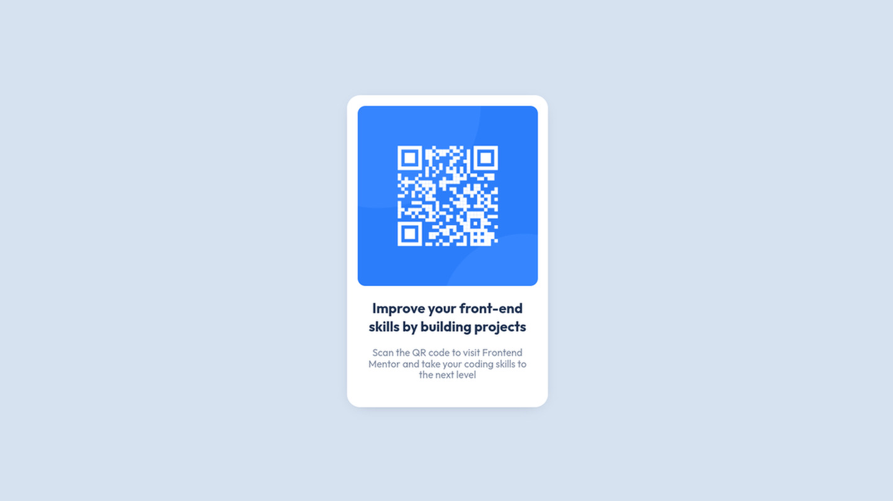

# Frontend Mentor - QR code component solution

This is a solution to the [QR code component challenge on Frontend Mentor](https://www.frontendmentor.io/challenges/qr-code-component-iux_sIO_H). Frontend Mentor challenges help you improve your coding skills by building realistic projects.

## Table of contents

- [Overview](#overview)
  - [Screenshot](#screenshot)
  - [Links](#links)
- [My process](#my-process)
  - [Built with](#built-with)
  - [What I learned](#what-i-learned)
  - [Continued development](#continued-development)
  - [Useful resources](#useful-resources)
- [Author](#author)

## Overview

### Screenshot

### Links

- [Solution - this repo](#overview)
- [Live site](https://anmac.github.io/frontend-mentor-challenge/newbie/qr-code-component-main/)

## My process

### Built with

- Semantic HTML5 markup
- Mobile-first workflow
- [Google Fonts](https://fonts.google.com/)
- [BEM Methodology](https://en.bem.info/methodology/css/)
- [Normalize.css v8.0.1](https://github.com/necolas/normalize.css)
- [Flexbox](https://css-tricks.com/snippets/css/a-guide-to-flexbox/)
- [CSS custom properties](https://css-tricks.com/a-complete-guide-to-custom-properties/)

### What I learned

I learned semantic html and custom properties with css using a graph tools to write clean code. I use [neovim](https://neovim.io/) as my IDE btw.

### Continued development

[Roadmap.sh](https://roadmap.sh) as a path for Frontend Developer.

### Useful resources

- [CSS Tricks](https://css-tricks.com/) - This helped me for some tricky things. I really liked this site and will use it going forward.
- [CSS Specificity Graph Generator](https://jonassebastianohlsson.com/specificity-graph/) - This is an interesting graph tool to see how horrible is my css code.
- [The best code editor ever](https://neovim.io/)

## Author

- Profile - [@anmac](https://github.com/anmac)
- Frontend Mentor - [@anmac](https://www.frontendmentor.io/profile/anmac)
